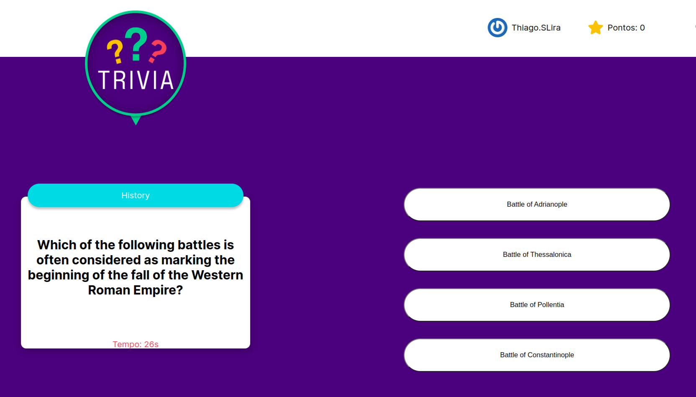

<h1>Trivia</h1>

A quiz game with challenges that will make your nights with friends more fun.

<h2>🚀 Objective</h2>

Develop a trivia game based on the Trivia game, using React and Redux. As a group project, develop the functionalities according to pre-defined demands on a Kanban board. It was essential for the group to be organized using the board for greater efficiency and minimizing code conflicts.
 

Working in a group is not an easy task, as the same problem can be solved in several ways. I was able to learn how to develop an application with different people from whom I learned a lot. It was also very challenging to work with the questions and answers received, indicating which ones are correct and which are the wrong alternatives. Setting a time limit for each question and calculating the score based on response time was one of the best projects I have ever worked on.

<h2>🛠️ Built With</h2>

<strong><em>JavaScript</em></strong> 
<strong><em>React</em></strong> 
<strong><em>React Testing Library</em></strong> 
<strong><em>Redux</em></strong> 

<h3>Project Look</h3>

I am available for contact, suggestions, and feedback on the project.

<h2>🎁 Expressions of Gratitude</h2>

Tell others about this project. 📢

